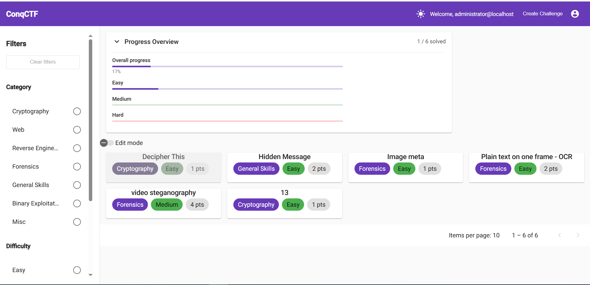
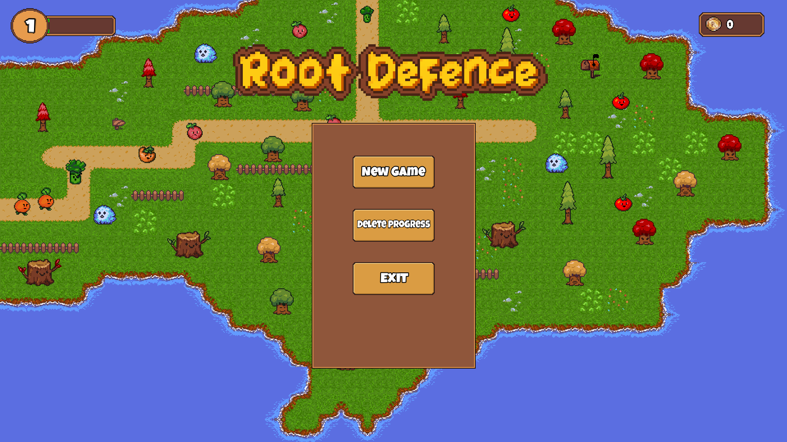
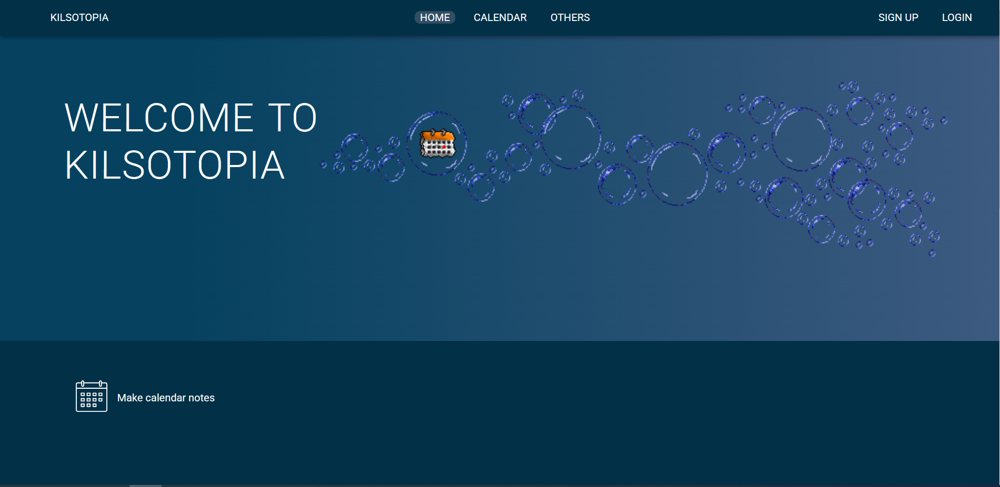

# Ivan Kamenov Portfolio

## Projects

---

### ConqCTF
.NET | Angular | SQL Server

#### description:
- Capture The Flag Platform. Begin your journey in cybersecurity by solving cool challenges and practice your skills. This project is designed for beginners in cybersecurity.

#### architecture:
- Clean Architecture
- Modular Component based

[View Github](https://github.com/Kilsombg/ConqCTF/)

 

---

 

### RootDefence
C++ | SD2

#### Genre:
RTS | Tower Defense

#### description:
-  Root Defence — a simple Tower Defense game built using C++ and SDL2. Build trees to defend your base from incoming vegetables.

[View Github](https://github.com/Kilsombg/RootDefence/)

 

---

 

### Kilsotopia
.NET | Angular | SQL Server

#### description:
-  Kilsotopia is a single page project to preview my projects. It has a Calendar-To-Do project.

#### architecture:
- Clean Architecture

|front-end|back-end|
|---|---|
|[web-app](https://github.com/Kilsombg/kilsotopia-web-app/) | [data](https://github.com/Kilsombg/kilsotopia-data/)|
